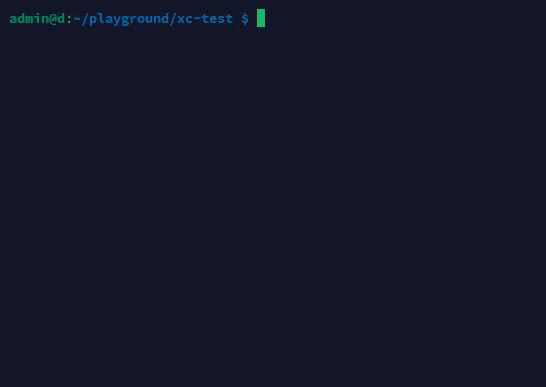

# xc
 
Jednoduchý nástroj pro sdílení příkazů mezi terminály. Uloží příkaz do souboru a spustí ho na vyžádání.
 

 
## Instalace
 
```bash
git clone https://github.com/9hb/xclipboard.git
cd xclipboard
cargo build --release
cp target/release/xc ~/.local/bin/
```
 
Na Windows zkopíruj `target\release\xc.exe` někam do PATH.
 
## Použití
 
```bash
# ulož příkaz
xc ls -la ~/.config
 
# spusť uložený příkaz
xc -p
```
 
Příkaz se ukládá do `~/.xc_clipboard`. Při spuštění přes `-p` vrátí `xc` stejný exit code jako původní příkaz.
 
## Požadavky
 
- Rust 1.85+
## Licence
 
MIT
 
