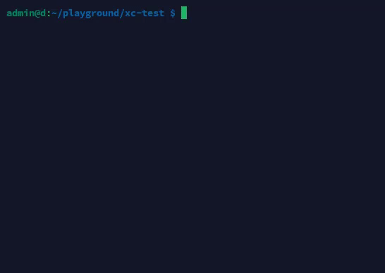

# XC - Command Line Tool

A simple tool for saving and executing commands from a clipboard.

## Installation

```bash
# Compile from repository
git clone https://github.com/[your-username]/xc-clipboard.git
cd xc-clipboard
cargo build --release

# Copy binary to a directory in PATH
cp target/release/xc ~/.local/bin/  # for Linux/MacOS
# or
copy target\release\xc.exe C:\Windows\System32\  # for Windows
```

## Usage

### Copying a command to clipboard

```bash
xc ls -la ~/.config
```

The command will be saved to a `.xc_clipboard` file in your home directory.

### Running a command from clipboard

```bash
xc -p
```

Executes the previously saved command and returns the same exit code.

## Demo

Watch a demo of the tool:



## How it works

1. **Copying a command:**

   - The program takes input arguments and saves them to a file in the home directory
   - Shows confirmation of copying

2. **Pasting and executing a command:**
   - The program reads the saved command from the file
   - Splits the command into executable file and arguments
   - Executes the command and passes all standard inputs/outputs
   - Exits with the return code of the executed command

## Practical usage

- Saving complex commands that are difficult to type
- Quickly repeating recent commands without command line history
- Sharing commands between different terminals

## Requirements

- Rust 1.85 or higher
- Access to the home directory for storing the clipboard file

## License

MIT
